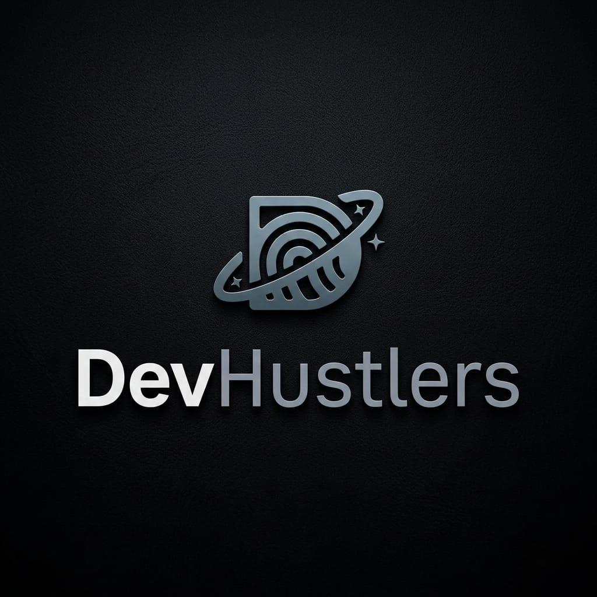

# DevHustlers - Funcky Tech Spark

 

A modern, high-performance community platform designed for developers to collaborate, learn, and ship products in real-time.

## 🚀 Overview

DevHustlers is a community-driven platform that empowers developers through gamification, real-time engagement, and resource sharing. This project, **Funcky Tech Spark**, serves as the core engine for managing challenges, events, and a competitive leaderboard.

### Key Features

- **Real-time Leaderboard**: Instantly updated rankings based on contribution points and challenge completions.
- **Challenge System**: Interactive coding challenges with status tracking (Live, Upcoming, Ended).
- **Event Management**: Timeline of upcoming tech events, workshops, and meetups.
- **Admin Dashboard**: Comprehensive management suite for users, tracks, and platform content.
- **Bilingual Support**: Full Arabic and English localization.
- **Optimized Real-time System**: Powered by Supabase Realtime for instant data synchronization across all clients.

## 🛠️ Tech Stack

- **Frontend**: [React](https://reactjs.org/) + [Vite](https://vitejs.dev/)
- **Language**: [TypeScript](https://www.typescriptlang.org/)
- **Database & Auth**: [Supabase](https://supabase.com/)
- **State Management**: [TanStack Query (React Query)](https://tanstack.com/query/latest)
- **Styling**: [Tailwind CSS](https://tailwindcss.com/)
- **Icons**: [Lucide React](https://lucide.dev/)
- **Animations**: [Framer Motion](https://www.framer.com/motion/)

## 🏁 Getting Started

### Prerequisites

- Node.js (v18+)
- npm or yarn

### Installation

1. **Clone the repository**
   ```bash
   git clone https://github.com/DevHustlers/funcky-tech-spark.git
   cd funcky-tech-spark
   ```

2. **Install dependencies**
   ```bash
   npm install
   ```

3. **Environment Setup**
   Create a `.env.local` file in the root directory and add your Supabase credentials:
   ```env
   VITE_SUPABASE_URL=your_supabase_url
   VITE_SUPABASE_ANON_KEY=your_supabase_anon_key
   ```

4. **Run Development Server**
   ```bash
   npm run dev
   ```

## 📡 Real-time Synchronization

The platform uses a custom hook-based architecture for real-time updates:
- `useRealtimeUsers`: Syncs the global user list.
- `useRealtimeLeaderboard`: Handles instant re-ranking of top performers.
- `useRealtimeChallenges` & `useRealtimeEvents`: Manages dynamic content updates without page refreshes.

## 🤝 Community

Join our community and stay updated:
- [WhatsApp Group](https://chat.whatsapp.com/Gm7LE9bGpFvLT8997CWEOP)

## 🚀 Deployment

The project is optimized for deployment on **Vercel**.

1. **Vercel Configuration**: 
   - Ensure the included `vercel.json` is pushed to your repository.
   - Set up the project on Vercel as a **Vite** project.
2. **Environment Variables**:
   Add these in the Vercel Dashboard:
   - `VITE_SUPABASE_URL`
   - `VITE_SUPABASE_ANON_KEY`
3. **Build Settings**:
   - **Build Command**: `npm run build`
   - **Output Directory**: `dist`

---

Built with ❤️ by the **DevHustlers Team**.
